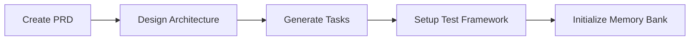
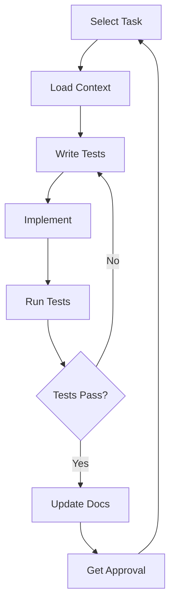

# Development Workflow Guide

*This guide provides a step-by-step workflow for using the Context Engineering Framework in development projects with Claude Code.*

## 🚀 Quick Start Workflow

### Phase 1: Project Initialization


### Phase 2: Development Cycle


## 📋 Detailed Workflow Steps

### Step 1: Project Setup

#### 1.1 Create Project PRD
```bash
# Copy PRD template
cp context-templates/prd-template.md memory-bank/PRD.md

# Prompt for Claude Code:
@memory-bank/PRD.md
Help me fill out this PRD for [project description].
Ask clarifying questions to ensure comprehensive requirements.
```

#### 1.2 Design Architecture
```bash
# Copy architecture template
cp context-templates/architecture-template.md memory-bank/ARCHITECTURE.md

# Prompt for Claude Code:
@memory-bank/PRD.md @memory-bank/ARCHITECTURE.md
Based on the PRD, help me design the technical architecture.
Consider scalability, security, and maintainability.
```

#### 1.3 Generate Task List
```bash
# Copy task tracker template
cp context-templates/task-tracker-template.md memory-bank/TASK-TRACKER.md

# Prompt for Claude Code:
@memory-bank/PRD.md @memory-bank/ARCHITECTURE.md @context-templates/task-generation-template.md
Generate a comprehensive task list for implementing this project.
Break down into phases with clear dependencies.
```

#### 1.4 Setup Test Framework
```bash
# Copy test framework template
cp context-templates/test-framework-template.md memory-bank/TEST-FRAMEWORK.md

# Initialize defect tracking
cp context-templates/defect-tracking-template.md memory-bank/DEFECTS.md
```

### Step 2: Development Execution

#### 2.1 Session Startup
```
@memory-bank/TASK-TRACKER.md @memory-bank/PRD.md @memory-bank/ARCHITECTURE.md

Starting development session.
Current status check - show active tasks and overall progress.
Ready to work on next priority task.
```

#### 2.2 Task Selection
```
Review TASK-TRACKER.md and select next task.
Confirm task selection and load specific context:

Working on Task [ID]: [Description]
Load relevant PRD section and architecture constraints.
What's the test strategy for this task?
```

#### 2.3 Test-Driven Development
```
For Task [ID], let's follow TDD:
1. Write failing tests first
2. Implement minimal code to pass
3. Refactor if needed
4. Update documentation

Start with test implementation.
```

#### 2.4 Implementation
```
Tests are written. Now implement the feature.
Follow architecture patterns and coding standards.
Ensure all tests pass before proceeding.
```

#### 2.5 Documentation Update
```
Implementation complete. Update:
1. Task status in TASK-TRACKER.md
2. Architecture status if needed
3. Any new patterns in TEST-FRAMEWORK.md
4. API documentation if applicable
```

### Step 3: Quality Assurance

#### 3.1 Run Test Suite
```
Run complete test suite for affected components:
- Unit tests
- Integration tests  
- Performance tests if applicable

Report coverage and any failures.
```

#### 3.2 Defect Management
```
If defects found:
@memory-bank/DEFECTS.md

Log defect DEF-XXX with:
- Severity and priority
- Steps to reproduce
- Root cause analysis
- Fix and verification
```

#### 3.3 Code Review
```
@memory-bank/ARCHITECTURE.md @memory-bank/PRD.md

Code review checklist:
- Architecture compliance ✓
- Test coverage adequate ✓
- Documentation updated ✓
- No security issues ✓
- Performance acceptable ✓
```

### Step 4: User Validation

#### 4.1 Prepare Validation
```
Task [ID] complete. Ready for validation:

What was implemented:
- [Feature description]
- [Key functionality]

How to test:
1. [Step 1]
2. [Step 2]
3. [Expected results]

Please test and confirm before proceeding.
```

#### 4.2 Gather Feedback
```
Based on your testing:
- Does it meet requirements? 
- Any issues found?
- Suggested improvements?

I'll address feedback before moving to next task.
```

### Step 5: Progress Tracking

#### 5.1 Regular Status Updates
```
Status Update:
- Phase: [Current phase]
- Progress: [X]% complete
- Tasks Completed: [List]
- Current Task: [In progress]
- Blockers: [Any issues]
- Next Priority: [Upcoming]
```

#### 5.2 Milestone Reviews
```
Milestone reached: [Phase X] complete

Summary:
- Tasks Completed: X of Y
- Test Coverage: XX%
- Defects: X resolved, Y open
- Performance: Meeting targets
- Next Phase: [Description]

Ready to proceed to next phase?
```

## 🔄 Iterative Patterns

### Daily Development Loop
```
Morning:
1. Load context and check status
2. Review any overnight feedback
3. Select next priority task

Development:
4. Follow TDD cycle
5. Regular test runs
6. Update documentation

Evening:
7. Commit changes
8. Update all status trackers
9. Summary for next session
```

### Weekly Checkpoint
```
Weekly Review:
- Tasks completed vs planned
- Test coverage trends
- Defect trends
- Architecture compliance
- Documentation currency
- Refactoring needs
```

## 🚨 Common Workflows

### Hotfix Workflow
```
1. Create defect entry with CRITICAL severity
2. Load minimal context (defect + related code)
3. Write regression test
4. Implement fix
5. Run full test suite
6. Fast-track review
7. Deploy with monitoring
```

### Feature Addition Workflow
```
1. Update PRD with new requirements
2. Assess architecture impact
3. Generate tasks for feature
4. Follow standard dev workflow
5. Update all documentation
6. Full regression testing
```

### Refactoring Workflow
```
1. Document refactoring goals
2. Ensure test coverage first
3. Make incremental changes
4. Run tests after each change
5. Update architecture docs
6. Performance comparison
```

### Performance Optimization Workflow
```
1. Establish baseline metrics
2. Profile to find bottlenecks
3. Create performance tests
4. Implement optimizations
5. Verify improvements
6. Document changes
```

## 📊 Workflow Metrics

Track workflow efficiency:

```markdown
## Workflow Metrics
- Avg task completion time: ___
- Test-first compliance: ___%
- Defect escape rate: ___%
- Documentation lag: ___ hours
- Context switch frequency: ___/day
- Rework percentage: ___%
```

## 🛠️ Workflow Automation

### Git Hooks
```bash
# pre-commit: Run tests and linting
# post-commit: Update task status
# pre-push: Full test suite
```

### Status Scripts
```bash
# Update all status dashboards
npm run status:update

# Generate progress report
npm run report:progress

# Check context completeness
npm run context:validate
```

## ⚡ Workflow Optimizations

### 1. Batch Similar Tasks
Group related tasks to minimize context switching:
- All database migrations together
- All API endpoints for a feature
- All test writing for a component

### 2. Parallel Documentation
Update docs while tests run:
- Implementation completes → trigger test run
- While tests run → update documentation
- Tests pass → commit everything

### 3. Context Preloading
Prepare next task context while current task runs:
- Current: Implementing Task 3.2
- Preload: Requirements for Task 3.3
- Smooth transition between tasks

## 🎯 Success Criteria

Each workflow phase should achieve:

### Development Phase
- [ ] All tasks have clear requirements
- [ ] Tests written before code
- [ ] Documentation updated in real-time
- [ ] Regular user validation
- [ ] No accumulating technical debt

### Quality Phase
- [ ] 80%+ test coverage maintained
- [ ] All defects logged and tracked
- [ ] Performance benchmarks met
- [ ] Security requirements validated
- [ ] Accessibility standards met

### Delivery Phase
- [ ] All tests passing
- [ ] Documentation complete
- [ ] Architecture current
- [ ] User acceptance confirmed
- [ ] Deployment checklist complete

---
*This workflow ensures systematic, quality-focused development with continuous validation and documentation.*